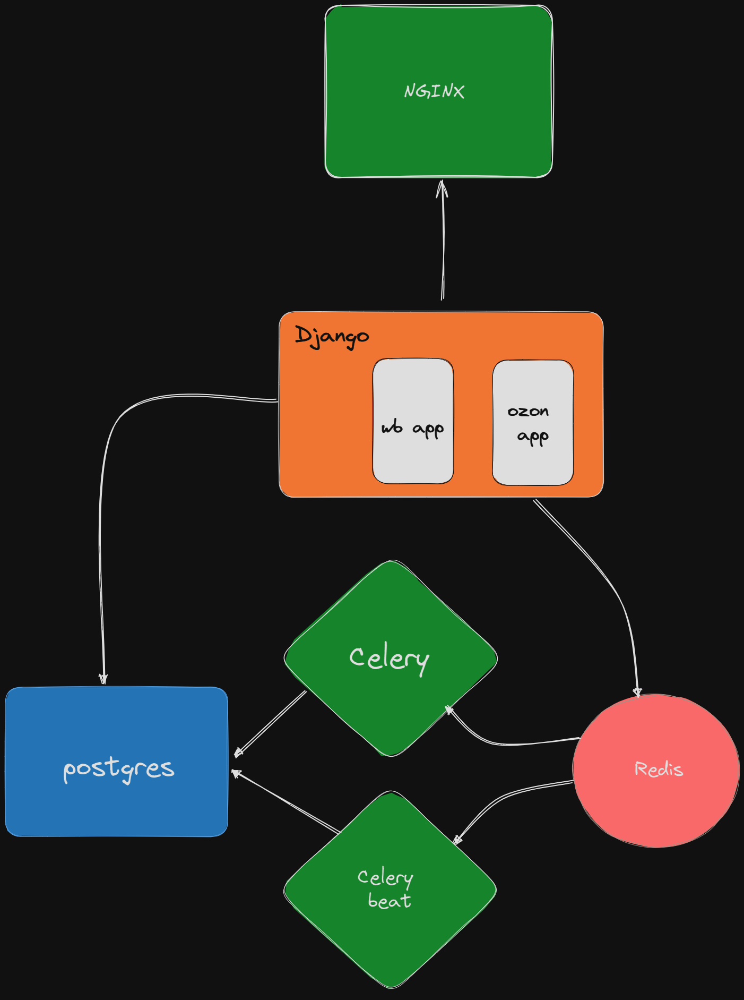

<h1>Привет</h1>

В этом ридми я постарался максимально подробно и понятно описать структуру и логику проекта. Если после прочтения останутся какие-либо вопросы и т.д., то ниже будут мои контакты

тг - t.me/se3ski

<h3>Дисклеймер</h3>

Проект писался командой зеленых разработчиков из 2 человек без технического руководства. Это не является оправданием каких-то ошибок, сделанных при создании проекта, но хотелось бы, чтобы на это делалась поправка. В остальном - мой тг в шапке файла, я буду очень рад объективной критике

<h2>Конфигурация</h2>

Проект полностью запускается в докер контейнерах, с помощью компоса поднимается 6 контейнеров, рисунок прилагается

В корневой папке проекта особо ничего интересного нет - на этом уровне лежат ключи другого разработчика, файл с инструкциями для контейнеров

<h2>Структура</h2>

в папке starter_expert хранятся докерфайлы и настройки для 2 контейнеров - <b>webapp</b> и <b>nginx</b>. В папке <b>starter</b> лежит непосредственно сам проект на джанге. У проекта 3 приложения: account, ozon и wb. account отвечает за вьюху с кабинетом и вход, вынес в отдельное приложение, чтобы 2 остальных со сбором данных не засерать в случае масштабирования и тд. ozon отвечает за сбор данных по озону - обоими приложениями сейчас никто не занимается, поэтому их можно пропустить. Приложение <b>wb</b> соответственно отвечает за сбор, обработку и выдачу данных по вайлдберриз. В папках static, templates и templatetags все по дефолту. В файле models.py хранятся модели, в tasks.py хранятся задачи для celery - какие то запускаются с определнной периодичностью, какие то привязаны к определенным представлениям. В views.py соответственно лежат вьюхи, какие-то cbv, какие-то fbv. Вся основная логика и инструменты для сбора, обработки данных и проч лежат в файле utils.py

<h2>Логика</h2>

Как я уже и сказал, вся логика, если это не какие-то операции с бдшкой на уровне вьюхи, скорее всего лежат в файле <b>utils.py</b>. Тут поподробнее хотел бы остановиться, потому что кода много, сходу разобраться тяжело будет. Есть некоторое количество мелких вспомогательных ф-й и классов, которые я не смог сгруппировать - все, что находится выше класса FileOperator. Я бы на них особо внимание не заострял. Далее идут классы, на которых основывается сбор данных.   
Класс URLOperator хранит в себе шаблоны ссылок для общения по апи и функции, которые этими шаблонами оперируют, возвращая уже готовые ссылки под нужные поисковые запросы.   
DataCollector содержит методы, как уже понятно из названия, которые собирают и упаковывают данные, полученные по апи. Большая часть методов (или все, точно не помню) принимают на вход ссылку, созданную URLOperator'ом.   
Класс DataOperator манипулирует теми данными, которые ему предоставил DataCollector - проверяет их на определенные совпадения, наличия, а также форматирует
  Класс Indexer координирует работу всех вышеописанных классов, полностью занимается сбором и обработкой данных

 <h5>Надеюсь, что этот ридми помог разобраться со структурой проекта, понять, как устроена работа сервиса и какие части кода за что отвечают <3</h5>